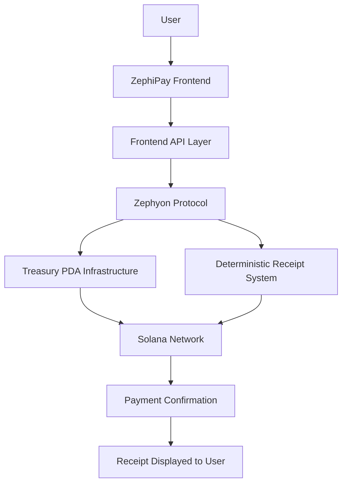

# ZephiPay / Zephyon Protocol — System Architecture

## Architecture Summary

ZephiPay provides the consumer-facing payment experience while Zephyon Protocol provides the underlying Solana-native payment infrastructure.

The frontend manages payment interaction and receipt display, while the protocol manages treasury-controlled payment execution and deterministic receipt generation on Solana.

This architecture keeps blockchain complexity beneath the user experience while preserving fast settlement, low transaction costs, and receipt-backed confirmation.