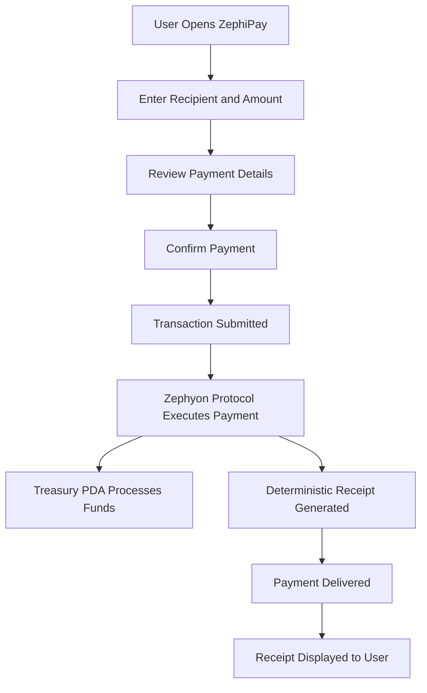

# ZephiPay — Payment Flow Diagram

## Flow Summary

ZephiPay is designed to make blockchain-powered payments feel simple and understandable from the user's perspective.

The user enters payment details, reviews the transaction, confirms the payment, and receives a receipt-backed confirmation after execution.

Behind the interface, Zephyon Protocol handles Solana-based payment execution, treasury accounting, deterministic receipt generation, and transaction confirmation logic.

This flow keeps the user experience familiar while preserving the speed, transparency, and reliability advantages of Solana infrastructure.